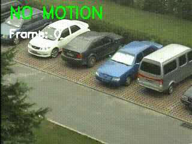

# A.R.G.U.S – Surveillance Monitoring System

A.R.G.U.S is a prototype surveillance monitoring system designed to analyze CCTV video streams and detect motion events in real time.

The goal of this project is to explore how automated surveillance systems monitor environments and trigger events when movement is detected.

## Demo

---

## Features

- Real-time motion detection from CCTV video streams  
- Moving object detection using frame comparison  
- Basic surveillance monitoring pipeline  

---

## Tech Stack

- Python  
- OpenCV  
- Computer Vision fundamentals  

---

## Project Motivation

Modern surveillance systems rely on automated monitoring to detect unusual activity without constant human supervision.  

This project is an experimental prototype that explores how video streams from CCTV cameras can be processed and analyzed to detect motion events automatically.

---

## Future Improvements

Planned improvements for the project:

- Object detection for identifying specific objects (cars, people, etc.)
- Alert / notification system when motion is detected
- Motion event logging
- Web-based monitoring dashboard
- Multi-camera monitoring support

---

## Author

**Kaan Güzel**

Computer Science student

GitHub: https://github.com/kaannguzel
